# UNISWAP_V2

### 手续费机制

$$
恒定乘积做市商算法（AMM）
(x+dx)(y-dy)=k=L^2
$$
$$
手续费f:  实际amountIn = (1-f)dx
$$
* 由于手续费的存在 流动性池子会缓慢的**增长**

> 套利空间（市场有很多的套利机器人）
>
> - 如果 DAI 在 DEX 上 **溢价**，套利者可：
>   - 抵押 ETH 铸造 DAI → 卖出 DAI 换取 USDT → 获利。
> - 如果 DAI **折价**，套利者可：
>   - 用 USDT 低价买入 DAI → 赎回抵押物（ETH）→ 获利


* LP(**Liquidity Provider**)收益于手续费

* 项目方（协议的提供者）分走的手续费（**Protocol Fee**）

  > TIP: uniSwap是收取了手续费的千6

  

>  详情请看白皮书 https://app.uniswap.org/whitepaper.pdf

* 具体代码

```solidity
    // if fee is on, mint liquidity equivalent to 1/6th of the growth in sqrt(k)
    function _mintFee(uint112 _reserve0, uint112 _reserve1) private returns (bool feeOn) {
        address feeTo = IUniswapV2Factory(factory).feeTo();
        feeOn = feeTo != address(0);
        uint _kLast = kLast; // gas savings
        if (feeOn) {
            if (_kLast != 0) {
                uint rootK = Math.sqrt(uint(_reserve0).mul(_reserve1));
                uint rootKLast = Math.sqrt(_kLast);
                if (rootK > rootKLast) {
                    uint numerator = totalSupply.mul(rootK.sub(rootKLast));
                    uint denominator = rootK.mul(5).add(rootKLast);
                    uint liquidity = numerator / denominator;
                    if (liquidity > 0) _mint(feeTo, liquidity);
                }
            }
        } else if (_kLast != 0) {
            kLast = 0;
        }
    }
        // this low-level function should be called from a contract which performs important safety checks
    function mint(address to) external lock returns (uint liquidity) {
        (uint112 _reserve0, uint112 _reserve1,) = getReserves(); // gas savings
        uint balance0 = IERC20(token0).balanceOf(address(this));
        uint balance1 = IERC20(token1).balanceOf(address(this));
        uint amount0 = balance0.sub(_reserve0);
        uint amount1 = balance1.sub(_reserve1);

        bool feeOn = _mintFee(_reserve0, _reserve1);
        uint _totalSupply = totalSupply; // gas savings, must be defined here since totalSupply can update in _mintFee
        if (_totalSupply == 0) {
            liquidity = Math.sqrt(amount0.mul(amount1)).sub(MINIMUM_LIQUIDITY);
           _mint(address(0), MINIMUM_LIQUIDITY); // permanently lock the first MINIMUM_LIQUIDITY tokens
        } else {
            liquidity = Math.min(amount0.mul(_totalSupply) / _reserve0, amount1.mul(_totalSupply) / _reserve1);
        }
        require(liquidity > 0, 'UniswapV2: INSUFFICIENT_LIQUIDITY_MINTED');
        _mint(to, liquidity);

        _update(balance0, balance1, _reserve0, _reserve1);
        if (feeOn) kLast = uint(reserve0).mul(reserve1); // reserve0 and reserve1 are up-to-date
        emit Mint(msg.sender, amount0, amount1);
    }
```

* 做了开关器是否打开protocol fee (目前还是没有打开)


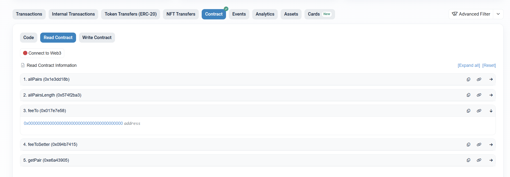

### 创建和移除流动性

#### 数学原理计算

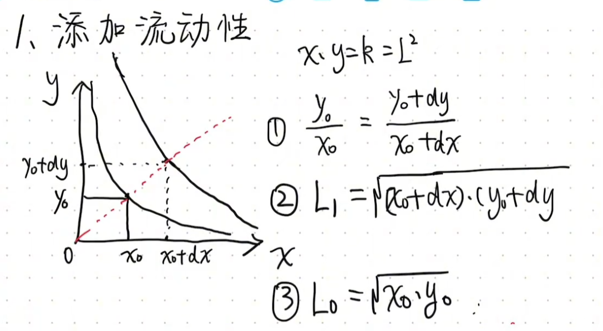


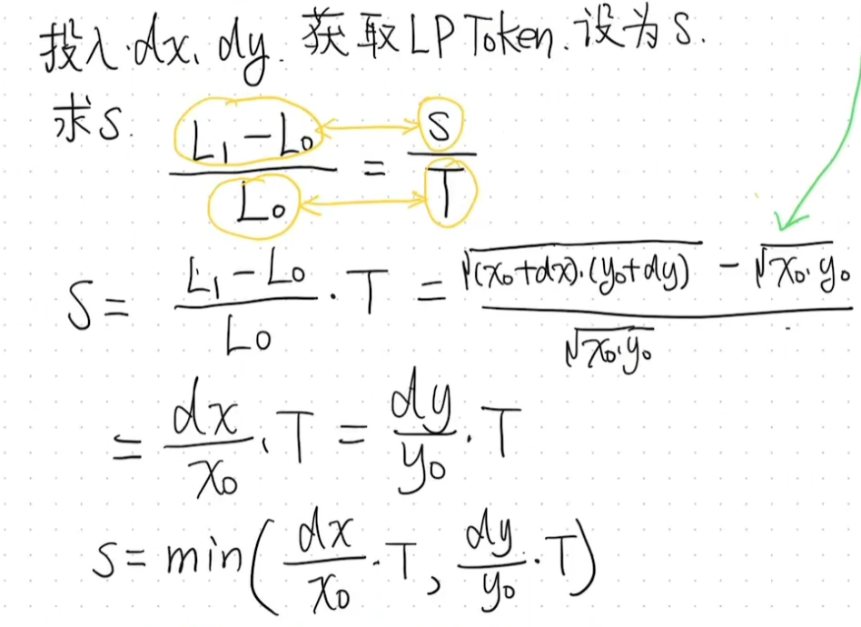


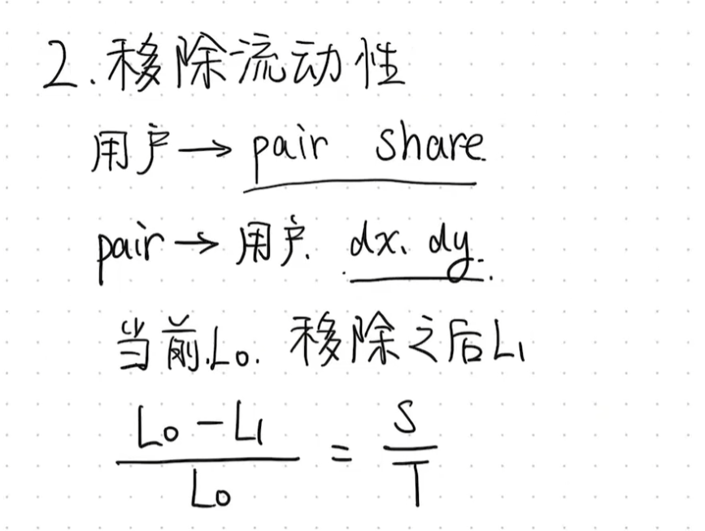

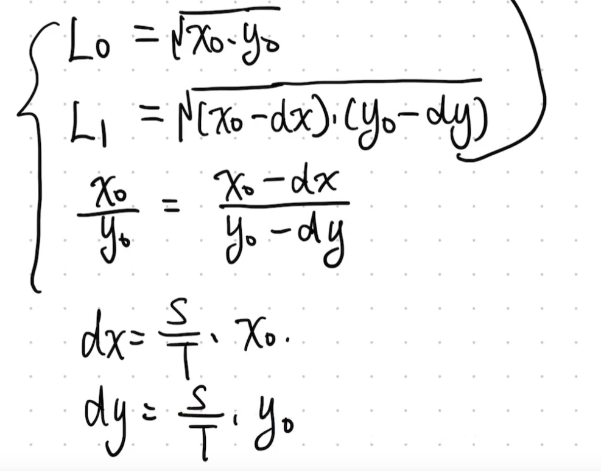


#### 流程图

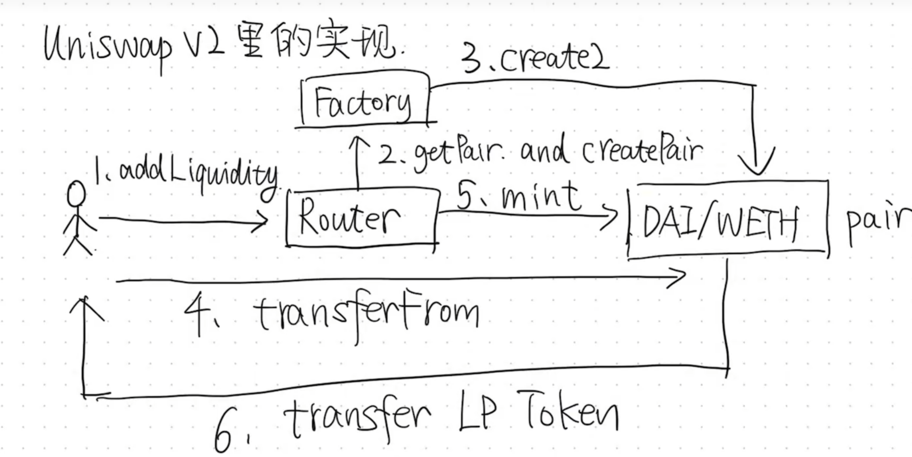

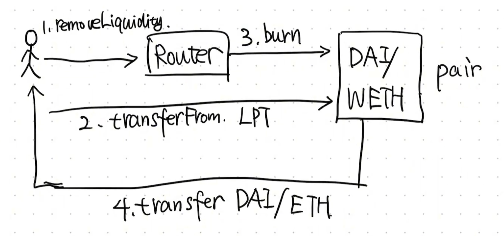

### 无常损失（Impermanent Loss）

#### 例子


### 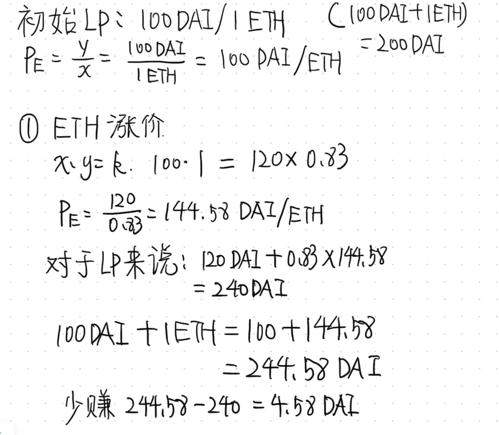


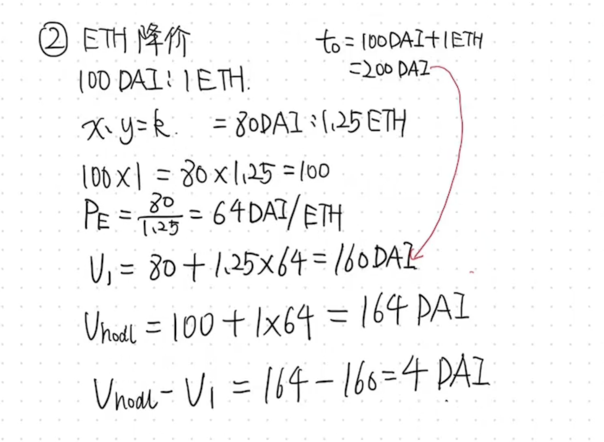


* 也就是在token涨价的时候，做市商（LP）会少赚钱，token在降价的时候，流动性提供者会多亏钱

#### 数学公式

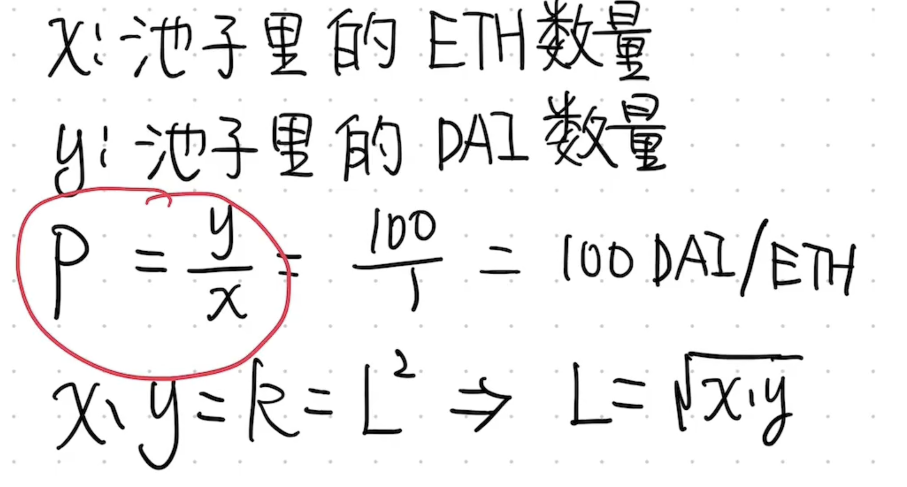

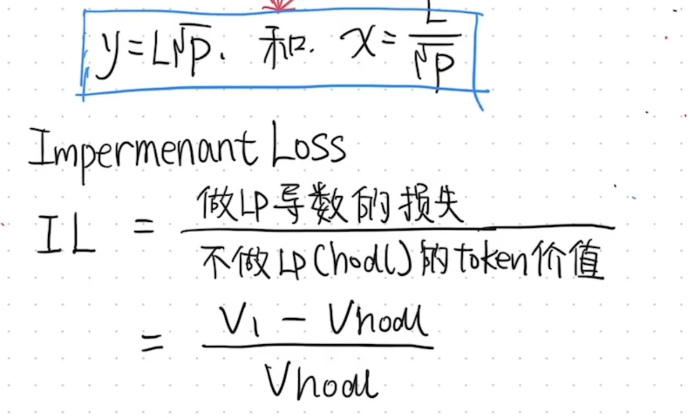

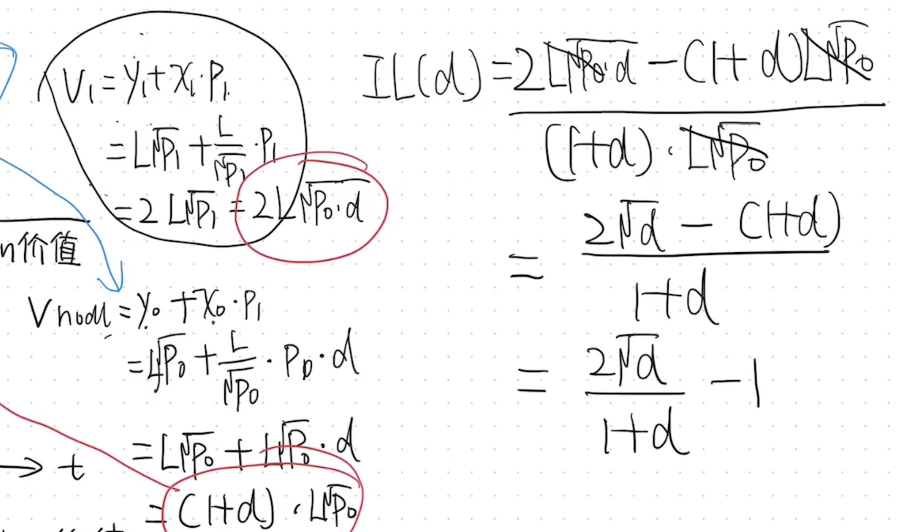


#### V2白皮书的Impermanent_loss

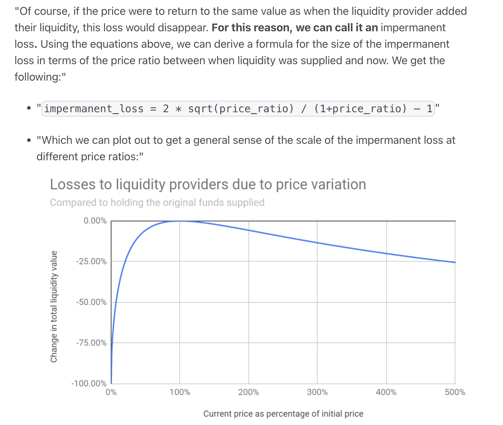


#### 参考链接

https://learnblockchain.cn/article/9310


### 闪电贷（Flash Swap）

#### 数学公式

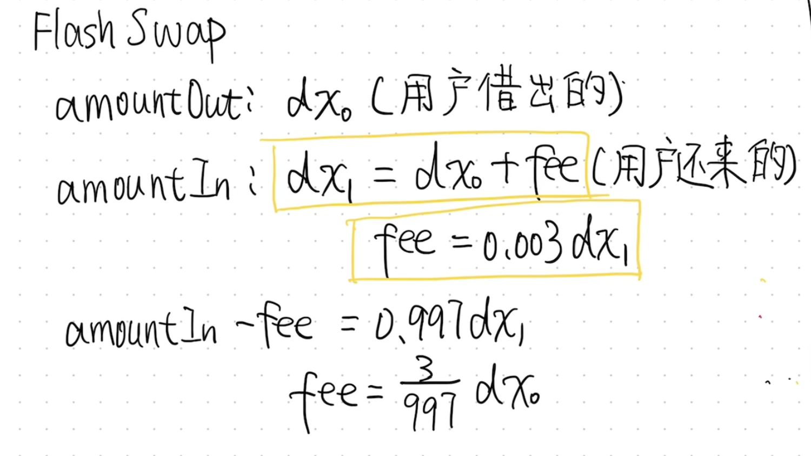

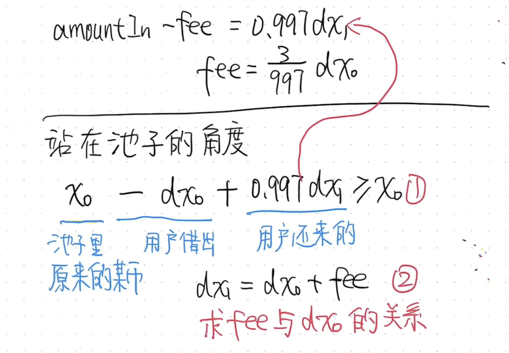

#### 流程图

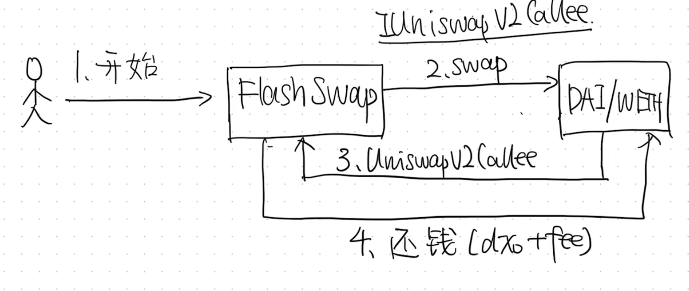


#### 代码

```solidity
    // this low-level function should be called from a contract which performs important safety checks
    function swap(uint amount0Out, uint amount1Out, address to, bytes calldata data) external lock {
        require(amount0Out > 0 || amount1Out > 0, 'UniswapV2: INSUFFICIENT_OUTPUT_AMOUNT');
        (uint112 _reserve0, uint112 _reserve1,) = getReserves(); // gas savings
        require(amount0Out < _reserve0 && amount1Out < _reserve1, 'UniswapV2: INSUFFICIENT_LIQUIDITY');

        uint balance0;
        uint balance1;
        { // scope for _token{0,1}, avoids stack too deep errors
        address _token0 = token0;
        address _token1 = token1;
        require(to != _token0 && to != _token1, 'UniswapV2: INVALID_TO');
        if (amount0Out > 0) _safeTransfer(_token0, to, amount0Out); // optimistically transfer tokens
        if (amount1Out > 0) _safeTransfer(_token1, to, amount1Out); // optimistically transfer tokens
        if (data.length > 0) IUniswapV2Callee(to).uniswapV2Call(msg.sender, amount0Out, amount1Out, data);
        balance0 = IERC20(_token0).balanceOf(address(this));
        balance1 = IERC20(_token1).balanceOf(address(this));
        }
        uint amount0In = balance0 > _reserve0 - amount0Out ? balance0 - (_reserve0 - amount0Out) : 0;
        uint amount1In = balance1 > _reserve1 - amount1Out ? balance1 - (_reserve1 - amount1Out) : 0;
        require(amount0In > 0 || amount1In > 0, 'UniswapV2: INSUFFICIENT_INPUT_AMOUNT');
        { // scope for reserve{0,1}Adjusted, avoids stack too deep errors
        uint balance0Adjusted = balance0.mul(1000).sub(amount0In.mul(3));
        uint balance1Adjusted = balance1.mul(1000).sub(amount1In.mul(3));
        require(balance0Adjusted.mul(balance1Adjusted) >= uint(_reserve0).mul(_reserve1).mul(1000**2), 'UniswapV2: K');
        }

        _update(balance0, balance1, _reserve0, _reserve1);
        emit Swap(msg.sender, amount0In, amount1In, amount0Out, amount1Out, to);
    }
    
    
    
 // 简易falsh_swap合约
 // SPDX-License-Identifier: MIT
pragma solidity ^0.8.20;

import "@openzeppelin/contracts/interfaces/IERC20.sol";

// uniswap will call this function when we execute the flash swap
interface IUniswapV2Callee {
    function uniswapV2Call(
        address sender,
        uint256 amount0,
        uint256 amount1,
        bytes calldata data
    ) external;
}

interface IUniswapV2Pair {
    function token0() external view returns (address);

    function token1() external view returns (address);

    function swap(
        uint amount0Out,
        uint amount1Out,
        address to,
        bytes calldata data
    ) external;
}

interface IUniswapV2Factory {
    function getPair(
        address token0,
        address token1
    ) external view returns (address);
}

// flash swap contract
contract FlashSwap is IUniswapV2Callee {
    address private constant WETH = 0xC02aaA39b223FE8D0A0e5C4F27eAD9083C756Cc2;
    address private constant UniswapV2Factory =
        0x5C69bEe701ef814a2B6a3EDD4B1652CB9cc5aA6f;

    // we'll call this function to call to call FLASHLOAN on uniswap
    function flashSwap(address _tokenBorrow, uint256 _amount) external {
        // check the pair contract for token borrow and weth exists
        address pair = IUniswapV2Factory(UniswapV2Factory).getPair(
            _tokenBorrow,
            WETH
        );
        require(pair != address(0), "!pair");

        // right now we dont know tokenborrow belongs to which token
        address token0 = IUniswapV2Pair(pair).token0();
        address token1 = IUniswapV2Pair(pair).token1();

        // as a result, either amount0out will be equal to 0 or amount1out will be
        uint256 amount0Out = _tokenBorrow == token0 ? _amount : 0;
        uint256 amount1Out = _tokenBorrow == token1 ? _amount : 0;

        // need to pass some data to trigger uniswapv2call
        bytes memory data = abi.encode(_tokenBorrow, _amount);
        // last parameter tells whether its a normal swap or a flash swap
        IUniswapV2Pair(pair).swap(amount0Out, amount1Out, address(this), data);
        // adding data triggers a flashloan
    }

    // in return of flashloan call, uniswap will return with this function
    // providing us the token borrow and the amount
    // we also have to repay the borrowed amt plus some fees
    function uniswapV2Call(
        address _sender,
        uint256 _amount0,
        uint256 _amount1,
        bytes calldata _data
    ) external override {
        // check msg.sender is the pair contract
        // take address of token0 n token1
        address token0 = IUniswapV2Pair(msg.sender).token0();
        address token1 = IUniswapV2Pair(msg.sender).token1();
        // call uniswapv2factory to getpair
        address pair = IUniswapV2Factory(UniswapV2Factory).getPair(
            token0,
            token1
        );
        require(msg.sender == pair, "!pair");
        // check sender holds the address who initiated the flash loans
        require(_sender == address(this), "!sender");

        (address tokenBorrow, uint amount) = abi.decode(_data, (address, uint));

        // 0.3% fees
        uint fee = ((amount * 3) / 997) + 1;
        uint amountToRepay = amount + fee;

        IERC20(tokenBorrow).transfer(pair, amountToRepay);
    }
}
```


#### 基于时间权重的平均价格（TWAP）

#### 数学公式

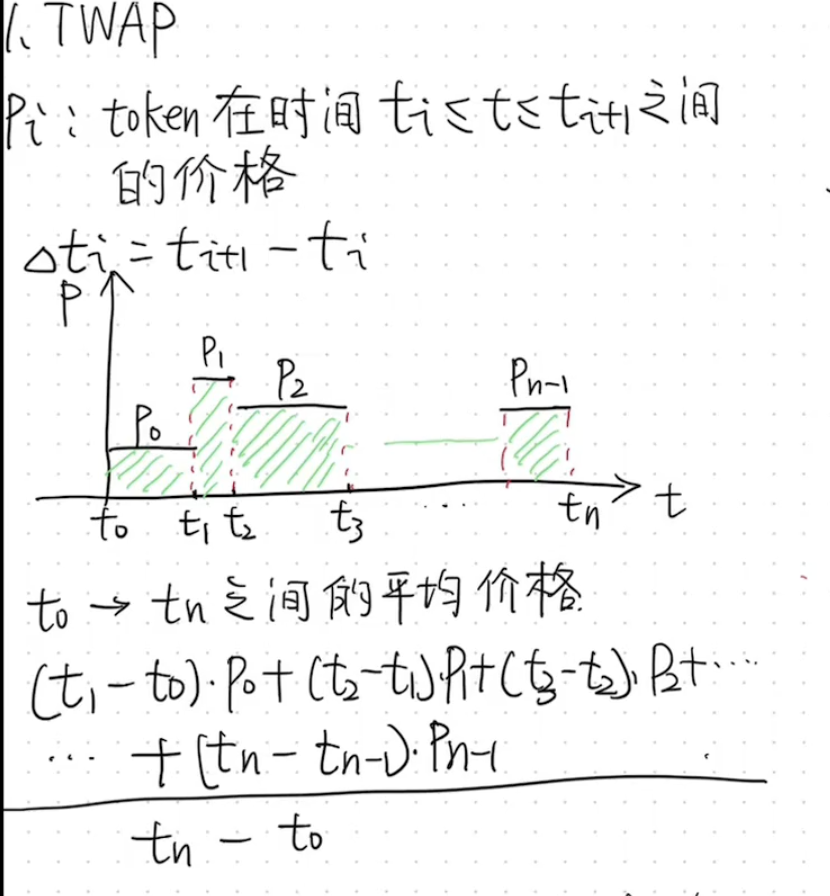

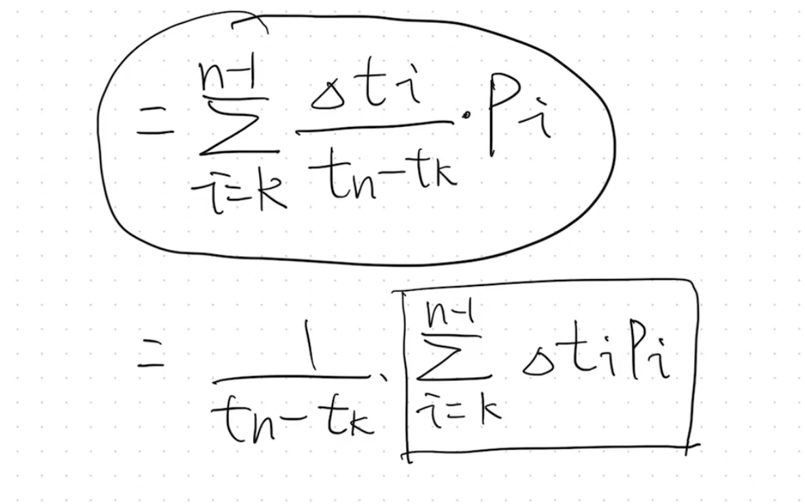

#### 代码

```solidity
// SPDX-License-Identifier: MIT
pragma solidity 0.6.6;

import "@uniswap/v2-core/contracts/interfaces/IUniswapV2Pair.sol";
import "@uniswap/lib/contracts/libraries/FixedPoint.sol";
import "@uniswap/v2-periphery/contracts/libraries/UniswapV2OracleLibrary.sol";
import "@uniswap/v2-periphery/contracts/libraries/UniswapV2Library.sol";


contract UniswapV2TWAP {
    using FixedPoint for *;

    uint public constant PERIOD = 1 hours;

    IUniswapV2Pair public immutable pair;
    address public immutable token0;
    address public immutable token1;

    uint public price0CumulativeLast;
    uint public price1CumulativeLast;
    uint public blockTimestampLast;

    FixedPoint.uq112x112 public price0Average;
    FixedPoint.uq112x112 public price1Average;

    constructor(IUniswapV2Pair _pair) public {
        pair = IUniswapV2Pair(_pair);
        token0 = _pair.token0();
        token1 = _pair.token1();
        price0CumulativeLast = _pair.price0CumulativeLast();
        price1CumulativeLast = _pair.price1CumulativeLast();
        (, , blockTimestampLast)= _pair.getReserves();
    }

    function update() external {
       (
           uint price0Cumulative,
           uint price1Cumulative,
           uint32 blockTimestamp
       ) = UniswapV2OracleLibrary.currentCumulativePrices(address(pair));

       uint timeElapsed = blockTimestamp - blockTimestampLast;
       require(timeElapsed > 1 hours, "time elapsed < 1h");

       price0Average = FixedPoint.uq112x112(
           uint224((price0Cumulative - price0CumulativeLast) / timeElapsed)
           );
        price1Average = FixedPoint.uq112x112(
           uint224((price1Cumulative - price1CumulativeLast) / timeElapsed)
           );

        price0CumulativeLast = price0Cumulative;
        price1CumulativeLast = price1Cumulative;
        blockTimestampLast = blockTimestamp;
    }

    function consult(address token, uint amountIn) 
       external view returns(uint amountOut) {
           require(token == token0 || token == token1);
           if (token == token0) {
               amountOut = price0Average.mul(amountIn).decode144();
           } else {
               amountOut = price1Average.mul(amountIn).decode144();
           }
       }

}
```