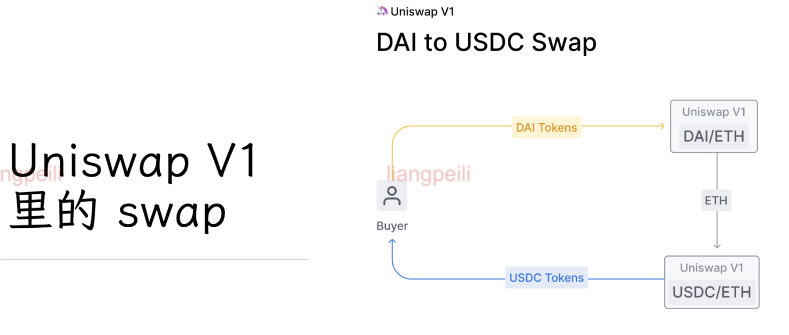
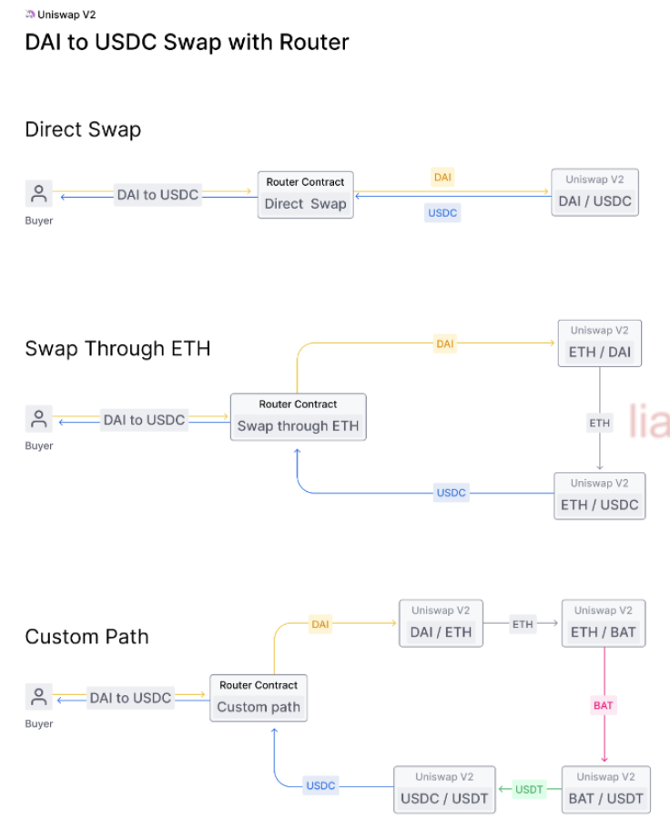
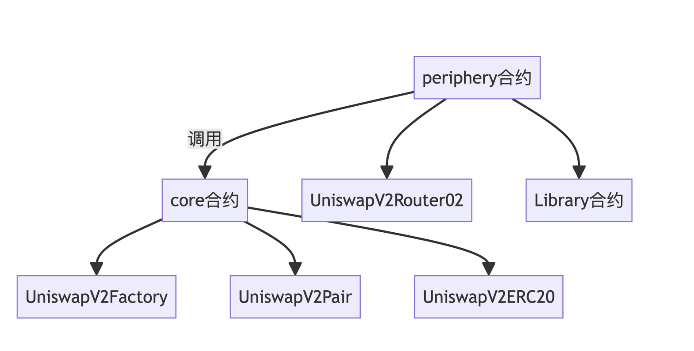

# Uniswap简史

## Unisawp诞生

- 2017年6月22日, Vitalik发表文章《On Path Independence》 ;
- 2017年7月6日，Hayden Adams 被西门子解雇，其朋友KarlFloersch 劝说其关注以太坊，并学习智能合约的开发；
- 2018年11月2日，Uniswap V1 部署到以太坊主网；

## Unisawp V1

- 2018年11月2日 发布；
- 使用 Vyper 语言编写；
- 仅支持 ERC20-ETH 直接互换或者通过ETH进行互换；
- 合约地址：https://github.com/Uniswap/v1-contracts

## Unisawp V2

- 2020年5月发布；
- 增加 ERC20-ERC20直接互换；

* 增加 Flash Swap；

- 增加 Oracle
- 改进手续费收取方式；
- 引爆了 Defi 赛道；
- 2020年9月，发行治理代币UNI;

## Unisawp V3

- 2021年5月，Uniswap V3 发布；
- 增加集中流动性；

* 优化手续费设置；

- LPT 改成基于 NFT 的 Liquidity Token；
- 改进开源协议；

## Unisawp V4

- 2023年6月23日发布代码草案；
- 新增主要特性：

- Hook
- Singleton Pool Manager Design
- Reintroduction of Native ETH
- Flash Accounting

•目标：更快、更省gasfee，容易集成；成为 DeFi 领域的基础设施；